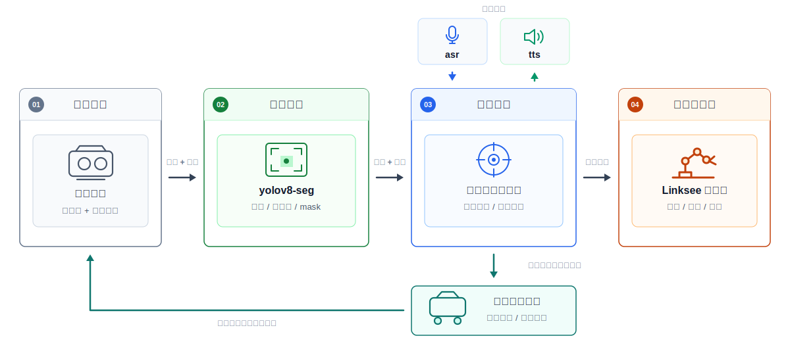

# Perceptive Grasp

Perceptive Grasp 是面向 Linksee 轮式机器人的感知抓取方案，用于完成桌面或近距离场景中的目标识别、空间定位、抓取规划和机械臂执行。系统以 D435i 深度相机作为感知输入，通过 YOLOv8-seg 目标检测，再结合深度反投影、手眼标定结果和顶抓策略生成 SO101 机械臂可执行的抓取位姿。

方案同时支持底盘辅助对齐和本地语音交互。当目标超出机械臂舒适抓取区时，系统会在规划阶段触发 Linksee 底盘短距离调整，停车后重新检测并重新规划；语音侧通过本地 ASR/TTS 语音桥接收抓取命令并播报任务状态，形成“语音输入、视觉感知、抓取规划、底盘辅助、机械臂执行”的闭环。

本方案抓取链路如图所示：



## 项目目录

```text
perceptive_grasp/
|-- CMakeLists.txt                 # C++ 构建配置
|-- package.xml                    # 软件包元信息
|-- requirements.txt               # Python 辅助脚本依赖
|-- config/                        # 主运行配置和模型配置
|-- docs/                          # 安装、配置、标定和调试文档
|-- include/                       # C++ 头文件
|-- resources/                     # 标定板、示意图和资源文件
|-- scripts/                       # Python 辅助脚本和本地语音桥
|-- src/                           # C++ 应用入口和核心流程实现
|-- tools/                         # 单帧检测、定位、规划和硬件调试工具
|-- tests/                         # Python 单元测试
`-- urdf/                          # SO101 机械臂模型
```

## 执行顺序

推荐按下面顺序准备、构建和运行项目：

| 顺序 | 文档 | 说明 |
|------|------|------|
| 1 | [SDK 依赖](docs/sdk_dependencies.md) | 准备 SDK 库、模型文件，并按顺序构建依赖组件 |
| 2 | [硬件环境](docs/hardware_setup.md) | 检查 K3、串口、相机、音频和 Python 环境 |
| 3 | [抓取配置](docs/grasp_config.md) | 配置相机、检测模型、机械臂、抓取参数和语音参数 |
| 4 | [手眼标定](docs/hand_eye_calibration.md) | 完成 ChArUco Eye-to-Hand 标定，并写回抓取配置 |
| 5 | [语音控制](docs/voice_control.md) | 配置本地 ASR/TTS 语音桥和命令链路 |
| 6 | [状态机](docs/pipeline_state_machine.md) | 了解运行状态、异步执行模型和失败状态含义 |
| 7 | [调试指南](docs/debugging.md) | 使用诊断脚本和调试工具定位检测、定位、规划或执行问题 |
| 8 | [抓取方案说明](docs/grasping_approaches.md) | 了解抓取技术路线和当前方案定位 |

## 获取 SDK

以 `~/spacemit_robot` 作为 SDK 工作目录：

```bash
mkdir -p ~/spacemit_robot
cd ~/spacemit_robot
repo init -u https://github.com/spacemit-robotics/manifest.git -b main -m default.xml \
  --repo-url=https://gitee.com/spacemit-robotics/git-repo
repo sync -j4
repo start robot-dev --all
```

## Python 环境

为 Python 辅助脚本创建虚拟环境：

```bash
cd ~/spacemit_robot/application/ros2/linksee/perceptive_grasp
python3 -m venv ~/.venv-grasp
source ~/.venv-grasp/bin/activate
pip install --upgrade pip
pip install -r requirements.txt
```

## 构建依赖

构建抓取应用前，按 [SDK 依赖](docs/sdk_dependencies.md) 准备系统依赖、SDK 组件和模型文件。

核心构建顺序如下：

```bash
cd ~/spacemit_robot
source build/envsetup.sh

cd components/control/base
mm

cd ~/spacemit_robot/components/model_zoo/vision
mm

cd ~/spacemit_robot/components/control/grasp
mm

# 按 components/control/manipulator/README.md 准备 Pinocchio 后再构建。
cd ~/spacemit_robot/components/control/manipulator
mm
```

下载 YOLOv8-seg 模型并准备 COCO 标签：

```bash
cd ~/spacemit_robot/components/model_zoo/vision/examples/yolov8_seg
bash scripts/download_models.sh

mkdir -p ~/.cache/models/vision/labels
cp ~/spacemit_robot/components/model_zoo/vision/assets/labels/coco.txt \
  ~/.cache/models/vision/labels/coco.txt
```

语音模型下载见 [SDK 依赖](docs/sdk_dependencies.md)。

## 构建

```bash
cd ~/spacemit_robot/application/ros2/linksee/perceptive_grasp
rm -rf build && mkdir -p build && cd build
source ~/spacemit_robot/build/envsetup.sh
cmake ..
make -j$(nproc)
```

## 运行前检查

```bash
cd ~/spacemit_robot/application/ros2/linksee/perceptive_grasp
source ~/spacemit_robot/build/envsetup.sh
source ~/.venv-grasp/bin/activate
python3 scripts/check_runtime_env.py --config config/grasp_pipeline.yaml
```

如果脚本输出 `[SUGGEST]` 串口建议，按 [抓取配置](docs/grasp_config.md) 写回 `config/grasp_pipeline.yaml`。

脚本加入 `dialout`、`audio`、`video` 用户组后，执行下面命令让当前终端重新加载用户组：

```bash
exec su - "$USER"
```

重新进入项目并激活环境后再检查：

```bash
cd ~/spacemit_robot/application/ros2/linksee/perceptive_grasp
source ~/spacemit_robot/build/envsetup.sh
source ~/.venv-grasp/bin/activate
python3 scripts/check_runtime_env.py --config config/grasp_pipeline.yaml
```

## 运行

抓取指定目标：

```bash
cd ~/spacemit_robot/application/ros2/linksee/perceptive_grasp/build
source ~/spacemit_robot/build/envsetup.sh
./perceptive_grasp --config ../config/grasp_pipeline.yaml --target banana
```

如果更换相机、调整安装位置，或抓取偏移/不稳定，运行前先按 [手眼标定](docs/hand_eye_calibration.md) 重新采集并写回 [配置文件](config/grasp_pipeline.yaml)。

## 底盘辅助对齐

当目标超出机械臂舒适抓取区时，可以启用底盘辅助对齐。底盘会先做短距离前进、后退或原地转向，停车后重新检测目标并重新规划抓取。

首次测试前确保机器人周围有安全空间，保持默认低速，观察一次短距离对齐动作后再调整参数。

## 语音模式

语音桥负责录音、VAD、ASR、TTS，并通过 stdin/stdout 与 `perceptive_grasp` 进程通信。

推荐使用 Python 语音桥启动完整语音控制：

```bash
cd ~/spacemit_robot/application/ros2/linksee/perceptive_grasp
source ~/spacemit_robot/build/envsetup.sh
source ~/.venv-grasp/bin/activate
python3 scripts/local_voice_bridge.py \
  --config config/grasp_pipeline.yaml \
  --binary build/perceptive_grasp
```

调试命令解析时，也可以直接启动文本语音模式，然后在终端输入“抓香蕉”等文本：

```bash
build/perceptive_grasp \
  --config config/grasp_pipeline.yaml \
  --voice-stdin \
  --status-stdout
```

语音桥识别到“抓香蕉”“停止”“结束”等命令后，会把文本写入抓取进程 stdin；抓取进程通过 stdout 输出状态事件，语音桥再调用 TTS 播报。语音模式下，抓取完成后机械臂停在观察位等待下一条命令；说“结束”或“回家”时回到 Home 姿态并退出程序。
