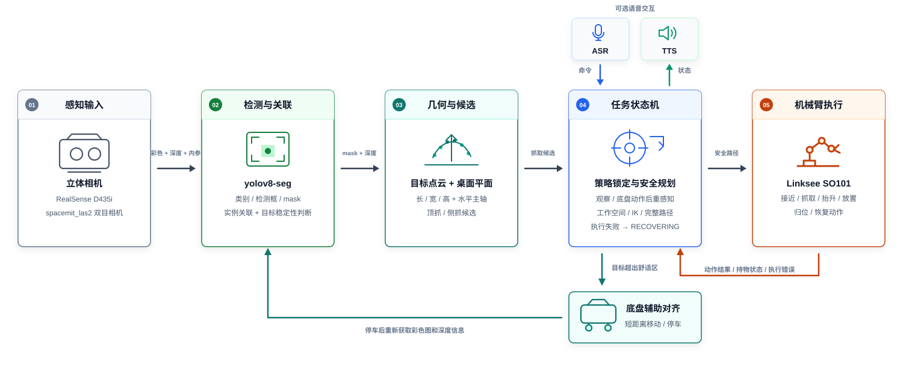

# perceptive_grasp

`perceptive_grasp` 是一套面向桌面场景的闭环视觉抓取方案。系统从 RGB-D 图像中识别目标、恢复其三维位置与形态，并据此选择抓取方式、验证运动路径和驱动机械臂完成抓取与放置。观察姿态或底盘位置改变后，系统重新感知场景并更新计划；任务异常时进入安全恢复流程。下图以 Linksee 真机抓取为主线，展示从 RGB-D 感知、目标检测与关联、三维几何估计到安全规划和机械臂执行的完整闭环。目标超出舒适抓取区时，底盘完成短距离对齐，系统在停车后重新感知并更新计划；语音交互作为可选入口，用于下发任务和播报执行状态。



同一套 pipeline 可连接 Linksee 真实硬件或 MuJoCo 仿真环境。真机模式用于实际部署，仿真模式用于在没有真实机械臂时验证完整方案，并为后续 Sim2Real 提供一致的配置结构和后端接口。

| 运行模式 | 配置 | RGB-D 输入 | 机械臂执行 | 部署方式 |
|---|---|---|---|---|
| Linksee 真机 | `config/grasp_pipeline.yaml` | RealSense D435i / `spacemit_las2` | SO101 / Linksee 底盘 | 感知、规划和执行均运行在 Linksee |
| PC 本地 MuJoCo | `config/grasp_pipeline_mujoco_ur5e.yaml` | MuJoCo realsense | MuJoCo UR5e | 仿真服务和 pipeline 运行在同一台 PC |
| PC/K3 连接 MuJoCo 服务 | `config/grasp_pipeline_remote_mujoco_ur5e.yaml` | MuJoCo realsense | MuJoCo UR5e | pipeline 运行在 PC 或 K3，与仿真服务分开部署 |

## 1. 功能范围

`perceptive_grasp` 提供以下功能：

- 支持 RealSense D435i 和 `spacemit_las2` 两种真机 RGB-D 后端，以及本地和远程 MuJoCo RGB-D 后端。
- 使用 YOLOv8-Seg 检测和分割目标，并在连续感知过程中关联目标实例；仿真配置可使用实例颜色辅助分割。
- 根据分割掩码和深度信息估计目标点云、桌面平面、三维尺寸和水平主轴。
- 根据目标三维形状和候选可执行性选择顶抓或侧抓，并生成对应抓取路径。
- 在规划阶段控制底盘短距离调整位置，停车后重新感知和规划。
- 在机械臂动作前验证工作空间、逆运动学、关节限制、桌面间隙和完整路径。
- 执行接近、夹取、抬升或退出、放置、归位和失败恢复动作。
- 可通过本地语音桥接收抓取、取消和结束命令，并播报任务状态。

本方案面向桌面或近距离场景中的单目标抓取。底盘辅助不包含导航、避障和全局路径规划。

## 2. 系统组成

| 模块 | 实现 | 作用 |
|---|---|---|
| RGB-D 输入 | RealSense D435i / `spacemit_las2` / MuJoCo | 输出像素对齐的彩色图像、深度图和相机内参 |
| 目标检测 | `vision_service` / OpenCV DNN | 运行 YOLOv8-Seg，输出目标类别、检测框和分割掩码 |
| 任务控制 | `grasp_pipeline` | 组织目标关联、策略锁定、观察或底盘动作后的重感知、机械臂执行和失败恢复 |
| 抓取规划 | `grasp_planner` / `grasp_geometry` | 估计目标点云和桌面平面，生成并验证顶抓或侧抓候选 |
| 机械臂执行 | `spacemit_manipulator` / `grasp` / MuJoCo | 控制 Linksee SO101 或 MuJoCo UR5e 机械臂和夹爪 |
| 底盘辅助 | `libchassis` | 调整机器人与目标的相对位置 |
| 语音交互 | `spacemit_audio` / VAD / ASR / TTS | 接收语音命令并播报任务状态 |
| MuJoCo 仿真 | `mujoco` / `remote_mujoco` | 在没有真实机械臂时验证感知、规划和执行方案，并提供 Sim2Real 验证环境 |

MuJoCo 模式复用真机 pipeline 的目标检测、三维估计、抓取规划、状态机和语音控制接口，通过仿真相机与仿真执行器替代真实硬件。开发者可以在没有真实机械臂的环境中验证完整抓取流程，并通过一致的配置结构和后端接口降低后续 Sim2Real 迁移成本。

## 3. 准备环境

1. 按[方案依赖](docs/sdk_dependencies.md)下载源码，安装系统依赖，构建依赖组件，并获取视觉和语音模型。
2. 按[硬件部署](docs/hardware_setup.md)连接 RGB-D 相机、机械臂、底盘和音频设备。

## 4. 配置

主配置文件为 [`config/grasp_pipeline.yaml`](config/grasp_pipeline.yaml)。首次部署时至少完成以下配置：

1. 确认机械臂和底盘的稳定串口路径。
2. 选择 RGB-D 输入后端，并填写后端所需的设备、模型和标定参数。
3. 完成 eye-to-hand 标定，更新当前相机后端对应的手眼标定结果。
4. 根据实际音频设备更新 ASR 和 TTS 设备编号。

字段说明和配置步骤见[抓取配置参考](docs/grasp_config.md)和[手眼标定](docs/hand_eye_calibration.md)。

## 5. 构建与检查

### 5.1 构建 K3 真机程序

以下命令用于 K3 上的 Linksee 真机抓取：

```bash
cd ~/spacemit_robot/application/ros2/linksee/perceptive_grasp
source ~/spacemit_robot/build/envsetup.sh
cmake -S . -B build
cmake --build build -j"$(nproc)"
```

构建目录中的 `perceptive_grasp` 是结构化日志启动器，`perceptive_grasp_core` 是实际运行抓取 pipeline 的 C++ 程序。正常运行应使用启动器。

### 5.2 检查 K3 真机运行环境

构建完成后先验证配置。该命令不初始化硬件：

```bash
./build/perceptive_grasp \
  --config config/grasp_pipeline.yaml \
  --validate-config
```

输出包含 `[Config] valid` 时，配置结构和字段取值通过检查。继续执行只读运行环境检查：

```bash
source ~/.venv-grasp/bin/activate
python3 scripts/check_runtime_env.py \
  --config config/grasp_pipeline.yaml \
  --build-dir build \
  --no-fix
```

检查脚本会同时验证启动器和核心程序。环境可运行时，最后一行显示：

```text
[SUMMARY] ready
```

## 6. 运行抓取

**以下命令会驱动机械臂和底盘。启动前清理机器人工作空间，确认急停和断电装置可用，并保持人员远离运动范围。**

抓取指定目标：

```bash
cd ~/spacemit_robot/application/ros2/linksee/perceptive_grasp
source ~/spacemit_robot/build/envsetup.sh
./build/perceptive_grasp \
  --config config/grasp_pipeline.yaml \
  --target banana
```

连续抓取：

```bash
./build/perceptive_grasp \
  --config config/grasp_pipeline.yaml \
  --target banana \
  --loop
```

连续抓取次数没有上限。每轮完成或失败恢复后，pipeline 返回观察位并立即检测下一轮目标。指定 `--target` 时只处理该类别；省略该参数时选择画面中稳定的最佳候选。循环模式不区分上一轮目标，视野内满足条件的目标可以再次被抓取。按一次 `Ctrl+C` 后，程序停止启动下一轮，完成安全归位后退出。

排查 RGB-D 输入、OpenCL、机械臂、运动学或底盘驱动时增加 `--debug` 来查看更多日志：

```bash
./build/perceptive_grasp \
  --config config/grasp_pipeline.yaml \
  --target banana \
  --debug
```

启动本地语音控制：

```bash
source ~/.venv-grasp/bin/activate
./build/perceptive_grasp \
  --voice-control \
  --config config/grasp_pipeline.yaml
```

使用 Qwen3-ASR 后端启动真机语音抓取：

```bash
source ~/.venv-grasp/bin/activate
./build/perceptive_grasp \
  --voice-control \
  --asr-backend qwen3_asr \
  --config config/grasp_pipeline.yaml
```

命令行参数只覆盖本次运行使用的 ASR 后端，不修改配置文件中的默认值。

## 7. 仿真运行

仿真模式由 PC 运行 MuJoCo 场景和可视化窗口。抓取 pipeline 可以与仿真服务共同运行在 PC，也可以运行在 K3。真机和仿真使用同一个 `perceptive_grasp` 启动器、状态机、YOLOv8-Seg 结果格式和抓取规划器，通过配置文件选择 RGB-D、目标检测与机械臂执行后端。

### 7.1 构建 PC MuJoCo 仿真程序

PC 仿真不使用 K3 的真实硬件后端，也不处理本地语音，因此关闭 WebRTC AEC 和 `spacemit_las2`：

```bash
cmake -S . -B build_mujoco \
  -DUSE_OPENCV_DNN=ON \
  -DUSE_MOCK_EXECUTOR=ON \
  -DENABLE_WEBRTC_AEC=OFF \
  -DENABLE_LAS2_CAMERA=OFF \
  -DENABLE_MUJOCO_EXECUTOR=ON \
  -DENABLE_REMOTE_MUJOCO=ON
cmake --build build_mujoco -j"$(nproc)"
ctest --test-dir build_mujoco --output-on-failure
```

不要在缺少 `meson` 和 `ninja-build` 的 PC 上直接使用默认的 `cmake -S . -B build`；该默认配置会启用用于 K3 语音交互的 WebRTC AEC。

### 7.2 启动 PC 仿真服务

```bash
./build_mujoco/perceptive_grasp \
  --serve-simulation \
  --config config/grasp_pipeline_mujoco_ur5e.yaml \
  --listen 0.0.0.0 \
  --port 9090 \
  --viewer
```

K3 运行远程仿真抓取：

```bash
./build_remote_mujoco/perceptive_grasp \
  --config config/grasp_pipeline_remote_mujoco_ur5e.yaml \
  --target apple \
  --remote-host <pc_ip>
```

K3 使用本地麦克风和扬声器控制远程仿真：

```bash
source ~/.venv-grasp/bin/activate
./build_remote_mujoco/perceptive_grasp \
  --voice-control \
  --config config/grasp_pipeline_remote_mujoco_ur5e.yaml \
  --remote-host <pc_ip>
```

仿真场景使用 MuJoCo Menagerie 的 UR5e 和 Robotiq 2F-85 模型，苹果和香蕉配置外观网格、纹理及用于物理接触的简化碰撞体。场景提供斜向下的虚拟 RGB-D 相机、机械臂与桌面碰撞检查、完整路径检查、双指接触判定和物理夹取。每次启动或显式重置场景时，`apple`、`banana`、`cube` 和 `cup` 都会在加宽的绿色取物区内单行排列，并随机调整排列顺序、位置和水平摆放角度。切换抓取目标不会重置场景，四个物体可以依次搬运到右侧独立的红色放置区。底盘辅助在仿真配置中保持关闭；语音交互运行在 K3，不依赖仿真服务的音频设备。构建、操作和验收步骤见[仿真运行](docs/simulation.md)。

## 8. 文档导航

- [方案依赖](docs/sdk_dependencies.md)（操作指南）：安装依赖、构建 SDK 组件、准备检测和语音模型。
- [硬件部署](docs/hardware_setup.md)（操作指南）：连接硬件、配置设备权限、验证 RGB-D 相机和串口。
- [抓取配置](docs/grasp_config.md)（参考）：说明配置文件字段、默认值、单位和约束。
- [手眼标定](docs/hand_eye_calibration.md)（操作指南）：生成标定板、采集数据、求解并写回标定结果。
- [语音控制](docs/voice_control.md)（操作指南）：配置 ASR/TTS 并启动本地语音桥。
- [仿真运行](docs/simulation.md)（操作指南）：在 PC 启动 MuJoCo，并在 K3 运行抓取 pipeline。
- [故障诊断](docs/debugging.md)（操作指南）：定位感知、规划、执行、底盘和性能问题。
- [pipeline 状态机](docs/pipeline_state_machine.md)（说明）：介绍状态转换、异步动作、输出事件和失败终态。
- [抓取方案](docs/grasping_approaches.md)（说明）：介绍感知定位、抓取规划、底盘介入条件和方案边界。

## 9. 许可证与第三方资源

`perceptive_grasp` 使用 [Apache License 2.0](../LICENSE)。MuJoCo 模型、网格和纹理的来源、固定版本及许可证见[仿真资源声明](simulation/mujoco/LICENSES.md)。
