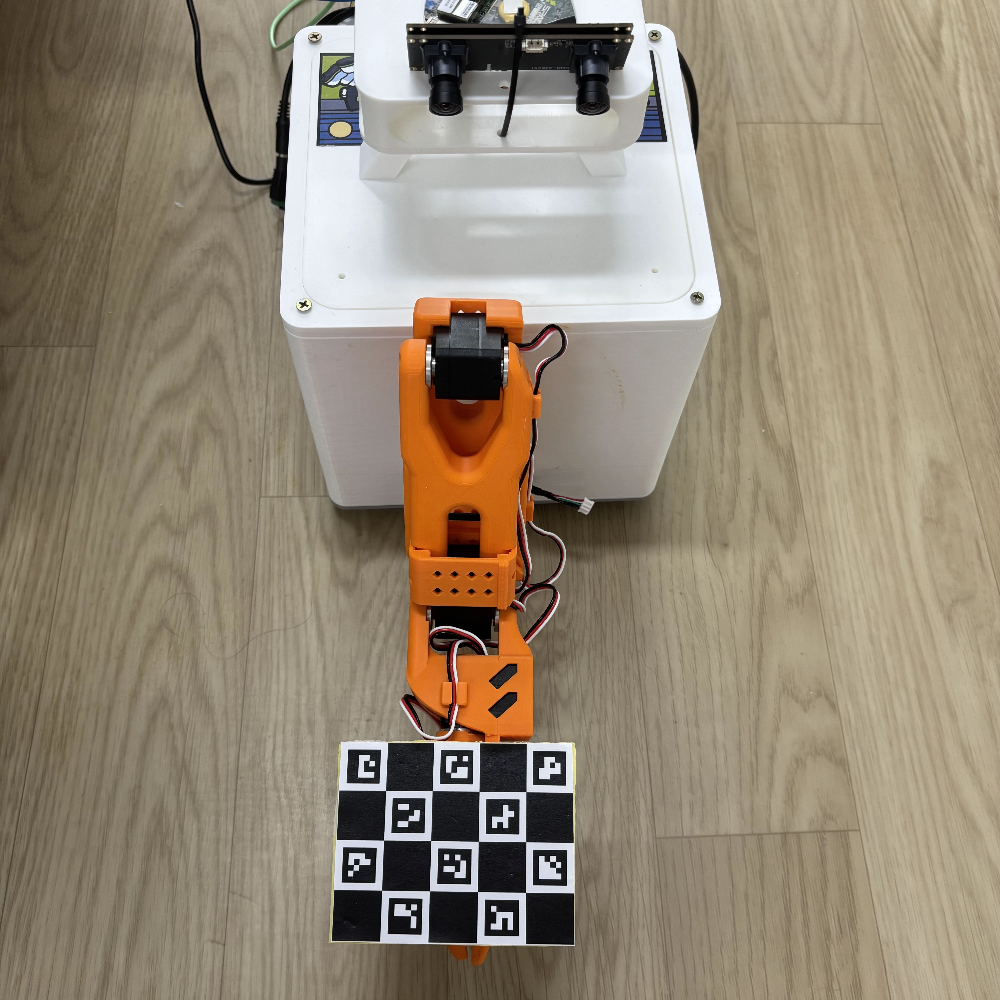

# 手眼标定

perceptive grasp 使用 eye-to-hand 标定计算立体相机坐标系到 Linksee 机械臂基座坐标系的变换。

## 1. 安装相机和标定板

立体相机固定在机身上，charuco 标定板固定在夹爪末端。如图所示：

<p align="center">
  
</p>

## 2. 准备标定环境

标定前确认：

- `config/grasp_pipeline.yaml` 中的 `camera.type` 和相机参数与当前硬件一致。
- 机械臂串口可访问，机械臂周围没有障碍物。
- python 环境已安装 `requirements.txt` 中的依赖。
- 立体相机和机械臂基座已经固定，标定完成前不再调整安装位置。

激活环境：

```bash
cd ~/spacemit_robot/application/ros2/linksee/perceptive_grasp
source ~/spacemit_robot/build/envsetup.sh
source ~/.venv-grasp/bin/activate
```

标定脚本读取 `camera.type`，支持 realsense d435i 深度相机和 spacemit_las2 双目相机。spacemit_las2 标定只采集校正后的逻辑左目彩色图，不启动深度推理。

## 3. 生成并打印标定板

生成 4 x 5 charuco 标定板：

```bash
python3 scripts/generate_charuco_board.py \
  --squares-x 4 \
  --squares-y 5 \
  --square-length 0.020 \
  --marker-length 0.014 \
  --output config/charuco_4x5_20mm_14mm.png
```

输出文件位于：

```text
config/charuco_4x5_20mm_14mm.png
```

按 100% 比例打印标定板，测量一个黑白方格和一个 aruco marker 的实际边长，再将标定板刚性固定在夹爪末端。采集命令必须使用实测尺寸，单位为米。

## 4. 采集标定样本

下面的示例尺寸对应 20 mm 方格和 14 mm marker：

```bash
python3 scripts/calibrate_hand_eye.py \
  --config config/grasp_pipeline.yaml \
  --charuco-squares-x 4 \
  --charuco-squares-y 5 \
  --charuco-square-length 0.020 \
  --charuco-marker-length 0.014 \
  --num-poses 15 \
  --dataset-dir "config/hand_eye_datasets/handeye_$(date +%Y%m%d_%H%M%S)"
```

脚本启动后会关闭机械臂扭矩并进入示教模式。手动将机械臂移动到新的采集姿态，松手并等待机械臂稳定后，按回车采集当前样本。

注意事项：

1. 采集姿态应覆盖工作空间的左、中、右、高、低位置以及不同腕部角度。相邻姿态至少改变两个关节，并保持标定板正面朝向相机。
2. 标定板应完整位于画面内，marker 边长不得小于 40 px。如果机械臂停止后仍有明显晃动，可增大 `--capture-settle-ms`。
3. 每次采集后，脚本会输出机械臂末端位置、标定板位置、重投影误差和 marker 尺寸。只有通过质量检查的样本才会写入数据集。

## 5. 求解并写回配置

将 `<dataset>` 替换为采集命令输出的数据集目录：

```bash
python3 scripts/calibrate_hand_eye.py \
  --solve-only \
  --dataset-dir config/hand_eye_datasets/<dataset> \
  --apply-config config/grasp_pipeline.yaml
```

脚本将结果写入：

```yaml
calibration:
  T_base_camera:
    translation: [x, y, z]
    rotation: [roll, pitch, yaw]
```

`translation` 的单位为米，`rotation` 的单位为弧度。

## 6. 验证标定结果

先检查运行环境：

```bash
python3 scripts/check_runtime_env.py \
  --config config/grasp_pipeline.yaml \
  --no-fix
```

再使用定位工具检查目标在机械臂基座坐标系中的位置：

```bash
./build/debug_localize \
  --config config/grasp_pipeline.yaml \
  --target banana \
  --frames 5
```

输出的 `base_point_m` 应与目标相对机械臂基座的实际位置一致。出现稳定方向偏差或固定距离偏差时，不要通过抓取偏移掩盖问题，应重新检查标定板尺寸、样本覆盖和相机安装稳定性。
