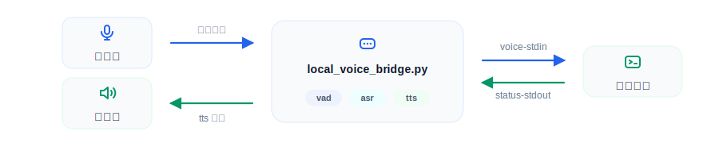

# 语音控制

Perceptive Grasp 使用本地语音桥接入 ASR/TTS：



## 1. 安装依赖

```bash
cd ~/spacemit_robot/application/ros2/linksee/perceptive_grasp
source ~/.venv-grasp/bin/activate
pip install -r requirements.txt
python3 -c "import spacemit_audio, spacemit_vad, spacemit_asr, spacemit_tts"
```

语音模型按 [SDK 依赖](sdk_dependencies.md) 下载到默认缓存目录。

## 2. 配置命令解析

修改 [config/grasp_pipeline.yaml](../config/grasp_pipeline.yaml)：

```yaml
voice:
  trigger_words: ["抓", "拿", "pick", "grab"]
  cancel_words: ["停止", "停", "取消", "别抓", "不要抓", "stop", "cancel"]
  target_aliases:
    香蕉: "banana"
    苹果: "apple"
    胡萝卜: "carrot"
    萝卜: "carrot"
    瓶子: "bottle"
    杯子: "cup"
```

`target_aliases` 的值必须是检测模型类别名。语音模式由启动命令决定，不需要在配置文件中开关。

## 3. 配置音频设备

```bash
cd ~/spacemit_robot/application/ros2/linksee/perceptive_grasp
source ~/spacemit_robot/build/envsetup.sh
source ~/.venv-grasp/bin/activate
python3 scripts/check_runtime_env.py --config config/grasp_pipeline.yaml
```

把输出中的设备编号写入配置：

```yaml
voice:
  asr:
    device: 1
    rate: 16000
    channels: 1
  tts:
    playback_device: 1
    mixer_volume: 80
```

K3 上默认使用 USB Camera 的单声道麦克风输入。TTS 播报使用 USB Audio 输出，并在启动时把该设备的 ALSA `PCM` 音量设为 80%。

## 4. 启动语音控制

推荐方式是启动本地 Python 语音桥。语音桥会自动启动 `perceptive_grasp --voice-stdin --status-stdout`，并负责录音、VAD、ASR、TTS 和状态播报：

```bash
cd ~/spacemit_robot/application/ros2/linksee/perceptive_grasp
source ~/spacemit_robot/build/envsetup.sh
source ~/.venv-grasp/bin/activate
python3 scripts/local_voice_bridge.py \
  --config config/grasp_pipeline.yaml \
  --binary build/perceptive_grasp
```

调试命令解析时，可以跳过 ASR/TTS，直接启动文本输入模式：

```bash
build/perceptive_grasp \
  --config config/grasp_pipeline.yaml \
  --voice-stdin \
  --status-stdout
```

启动后在终端输入语音识别后的文本，例如“抓香蕉”。

语音命令示例：

```text
抓香蕉
停止
结束
```

`停止` 会停止当前任务，并回到观察位等待下一条抓取命令；`结束`、`待命`、`休息`、`回家`、`回 home`、`回初始`、`end` 和 `home` 会让机械臂回到 Home 姿态，然后退出程序。

抓取状态会通过 TTS 播报，终态调试文件保存在 `debug.output_dir`。
